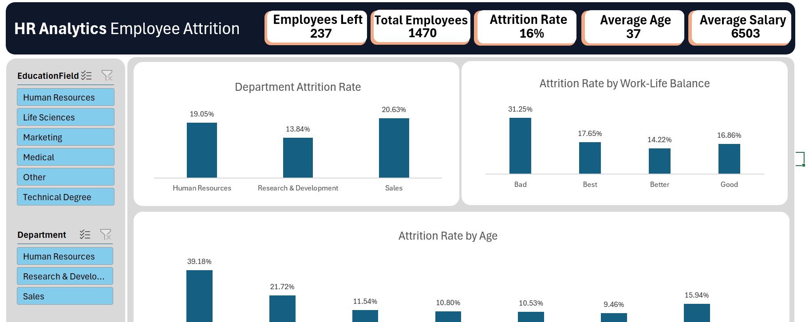

# 📊 HR Analytics Dashboard | Employee Attrition Analysis

## 📌 Project Overview

This project presents an interactive **HR Analytics Dashboard** built in **Microsoft Excel** to analyze employee attrition and identify key factors influencing employee turnover. The dashboard enables HR professionals and business stakeholders to explore workforce trends through interactive visualizations and slicers, supporting data-driven decision-making.

---

## 🎯 Objectives

* Analyze employee attrition across different demographics.
* Identify factors contributing to employee turnover.
* Build an interactive Excel dashboard for HR insights.
* Demonstrate data analysis and business intelligence skills using Excel.

---

## 🛠️ Tools & Technologies

* Microsoft Excel
* Power Query
* Power Pivot
* DAX (Data Analysis Expressions)
* Pivot Tables
* Pivot Charts
* Slicers
* KPI Cards

---

## 📈 Dashboard Features

### Key Performance Indicators (KPIs)

* Total Employees
* Employees Left
* Attrition Rate
* Average Employee Age
* Average Monthly Salary

### Interactive Filters

* Department
* Job Role
* Gender
* Marital Status
* Overtime
* Education Field

### Business Insights

* Attrition Rate by Department
* Attrition Rate by Age Group
* Attrition by Gender
* Attrition by Marital Status
* Attrition by Work-Life Balance
* Attrition by Job Satisfaction
* Attrition by Years at Company
* Income vs Attrition

---

## 💡 Key Findings

* Employees aged **18–24** have the highest attrition rate.
* Employees working **overtime** are significantly more likely to leave.
* The **Sales** department experiences the highest employee attrition.
* Lower-income employees exhibit higher turnover rates.
* Employees with poor work-life balance show increased attrition.

---

## 📷 Dashboard Preview

### Main Dashboard
```


## 📂 Project Structure

```text
HR-Analytics-Dashboard/
│
├── Dashboard Project 5.xlsx
├── README.md
├── images p5/
│   ├── dashboard.png
│   ├── dashboard2.png
│   └── dashboard3.png
└── dataset p5/
    └── HR_Employee_Attrition.csv
```

---

## 🚀 Skills Demonstrated

* Data Cleaning
* Data Transformation
* Data Modeling
* Dashboard Design
* Business Intelligence
* Data Visualization
* KPI Development
* DAX Calculations
* HR Analytics

---

## 📚 Future Improvements

* Recreate the dashboard in Power BI.
* Add predictive attrition analysis using Python.
* Include trend analysis over time.
* Add drill-through and advanced filtering.

---

## 👨‍💻 About Me

I'm **Syed Sami Ullah**, an aspiring Data Analyst passionate about transforming raw data into meaningful business insights. I enjoy building interactive dashboards, solving analytical problems, and continuously improving my skills in Business Intelligence, SQL, Python, and Data Visualization.

If you have feedback or suggestions, feel free to connect with me!

⭐ If you found this project helpful, consider giving it a star!
